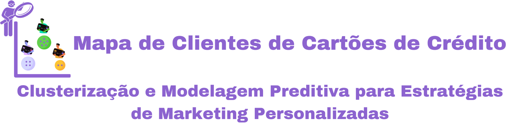
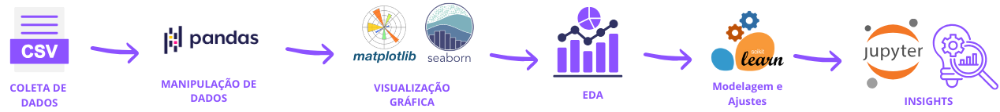
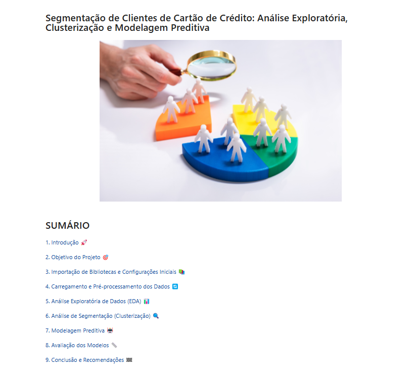
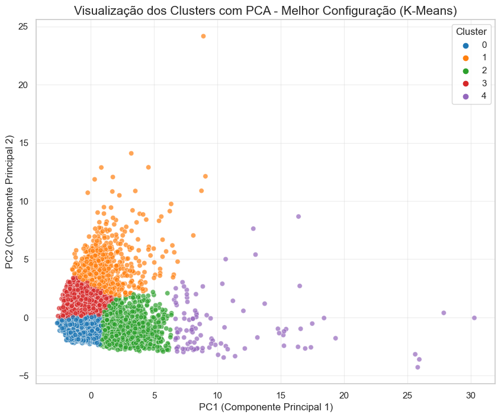
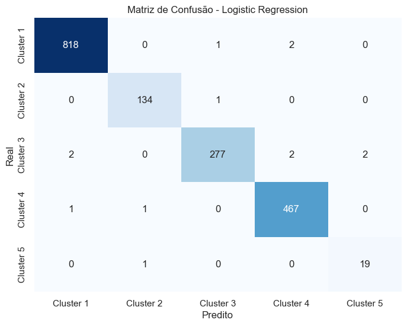

# 💳 Mapa de Clientes de Cartões de Crédito

## 📝 Descrição do Projeto  
Este projeto, desenvolvido como parte do módulo final do **Santander Coders 2024**, explora a **segmentação de clientes** e **modelagem preditiva** aplicadas ao setor financeiro, com foco em titulares de cartões de crédito. 

O objetivo principal é identificar padrões comportamentais dos clientes para otimizar estratégias de marketing e suporte a decisões empresariais. As principais etapas incluem a análise exploratória de dados, a criação de clusters para segmentação de clientes e a construção de um modelo preditivo para classificar novos clientes nos grupos definidos.

**Destaques do Projeto:**
- **Segmentação de Clientes**: Identificação de grupos com características semelhantes para personalização de estratégias.
- **Modelagem Preditiva**: Classificação de novos clientes nos clusters definidos, utilizando aprendizado supervisionado.
- **Insights Estratégicos**: Suporte à equipe de marketing e ao gerenciamento de riscos financeiros.

  

---

## 🗂️ Estrutura do Repositório
Este repositório está organizado da seguinte forma:
- **01_Base_de_Dados**: Contém os arquivos de dados utilizados para análise.
- **02_Analise**: Contém o arquivo Jupyter Notebook com a análise e modelagem.
- **03_Recursos**: Contém recursos visuais utilizados no projeto.

---
## 💾 Demonstração e Uso
Para explorar a análise, você pode seguir uma das opções abaixo:

1. **Visualização Direta no GitHub**:
   - Vá até a pasta **02-Analise** e abra o arquivo **Jupyter Notebook** diretamente no GitHub para visualizar a análise sem precisar baixar.
   - [Clique aqui para acessar a pasta de análise](02-Analise/credit-card-customer-clustering.ipynb).

2. **Download do Notebook**:
   - Caso a visualização no GitHub não funcione adequadamente ou prefira trabalhar localmente, você pode baixar o arquivo que está no caminho anterior.
   

3. **Instruções de Uso Local**:
   - Após baixar, abra o notebook no Jupyter ou em uma plataforma que suporte notebooks IPython.
   - Execute as células sequencialmente para visualizar as análises e gráficos.

## 🔍 Estrutura do Projeto

### Parte 1: Análise Exploratória de Dados (EDA)
- **Distribuição de Variáveis**: Análise de padrões e identificação de valores extremos nos dados.
- **Correlação Entre Variáveis**: Descoberta de relações importantes para segmentação e predição.
- **Análise de Outliers**: Investigação de valores atípicos que poderiam distorcer os resultados.

### Parte 2: Clusterização
- **Aplicação de Algoritmos**: Teste de K-Means, Hierarchical Clustering e DBSCAN.
- **Escolha do Modelo Ideal**: O K-Means foi escolhido com base em métricas como Silhouette Score e Davies-Bouldin Index.
- **Interpretação dos Clusters**: Identificação de cinco grupos principais com perfis distintos de clientes.

### Parte 3: Modelagem Preditiva
- **Treinamento de Modelos Supervisionados**: Teste de algoritmos como Logistic Regression, Decision Tree e Random Forest.
- **Avaliação e Otimização**: Ajustes finos para maximizar a precisão e recall do modelo.
- **Predição de Novos Clientes**: Classificação de novos dados nos clusters definidos para ações personalizadas.

---

## 🏗️ Arquitetura e Fluxo de Análise

O fluxo de análise do projeto segue a estrutura abaixo:

1. **Coleta de Dados**: Importação do dataset com informações dos clientes de cartões de crédito.
2. **Manipulação e Limpeza de Dados**: Uso de **Pandas** para tratar dados e garantir consistência.
3. **Visualização Gráfica**: Criação de gráficos com **Matplotlib** e **Seaborn** para explorar os padrões dos dados.
4. **EDA**: Compreensão inicial das características do dataset.
5. **Clusterização**: Identificação de grupos distintos de clientes com algoritmos de aprendizado não supervisionado.
6. **Modelagem Supervisionada**: Construção de modelos para prever o cluster de novos clientes.
7. **Insights**: Extração de resultados para decisões estratégicas.

---

## 📈 Impacto e Resultados

- **Clusters Identificados**: Cinco grupos principais foram descobertos, representando perfis distintos, como clientes inativos, consumidores regulares e clientes premium.
- **Precisão da Modelagem**: O modelo de **Logistic Regression** alcançou um F1-Score Macro de 0.978 no conjunto de teste, garantindo alta sensibilidade na classificação.
- **Recomendações Estratégicas**: 
  - **Clientes Premium**: Foco em serviços exclusivos.
  - **Clientes Inativos**: Estratégias de reengajamento.
  - **Consumidores Regulares**: Ofertas promocionais personalizadas.

---

## 🛠️ Tecnologias Utilizadas
- [Python](https://www.python.org/)
- [Jupyter Notebook](https://jupyter.org/)
- [Pandas](https://pandas.pydata.org/)
- [Matplotlib](https://matplotlib.org/)
- [Seaborn](https://seaborn.pydata.org/)
- [Scikit-Learn](https://scikit-learn.org/)

---

## 🖼️ Screenshots
Aqui estão algumas capturas de tela das análises:

---

## 📞 Contato
- 📫 Você pode entrar em contato comigo pelo meu [e-mail](mailto:thiago.leit@hotmail.com).
- 💼 Meu perfil no [LinkedIn](https://www.linkedin.com/in/tnleite/) para acompanhar meu progresso e projetos.
- ✍🏻 Meu perfil no [Medium](https://medium.com/@thiago.leit) para ver artigos publicados.
- 🌐 Meu [Portfólio](https://thiagoleitedata.com.br) para visualizar outros projetos.

